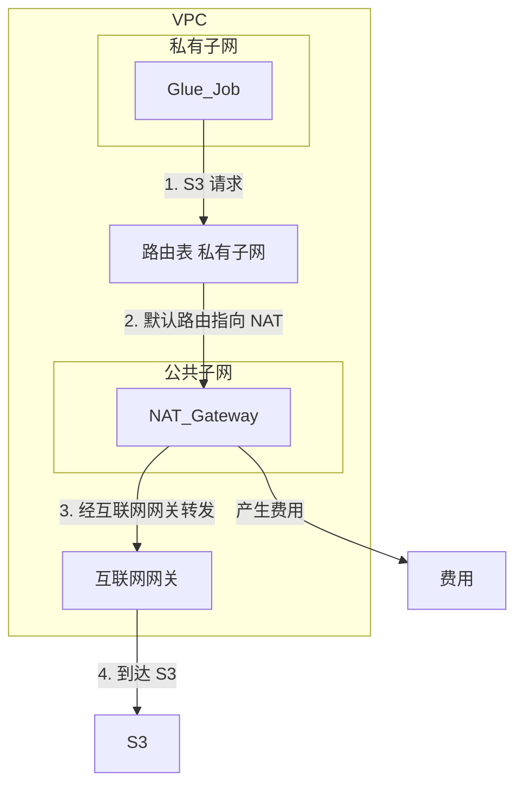
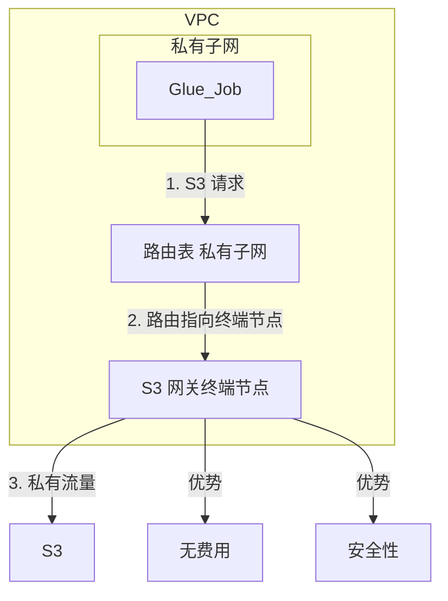
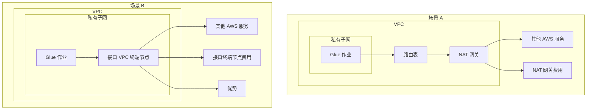

# AWS Glue从S3抽取数据是否收取NAT Gateway流量费？ 如何优化这部分费用？

是的，在特定情况下，AWS Glue从S3抽取数据**可能会产生NAT Gateway流量费用**。

这主要取决于您的AWS Glue作业的网络配置：

1. **当Glue作业在您的VPC中运行，并且需要访问S3时：**
   - 如果您的Glue作业运行在VPC的私有子网 (Private Subnet) 中：
     - 私有子网中的资源（如Glue作业的ENI）默认无法直接访问互联网或AWS的公共服务终端节点（如S3的公共终端节点 `s3.<region>.amazonaws.com`）。
     - 如果您配置了一个NAT Gateway，并将私有子网的路由表指向该NAT Gateway以访问外部服务，那么Glue作业访问S3的流量就会通过这个NAT Gateway。
     - 在这种情况下，**会产生NAT Gateway的数据处理费用**（通常按GB计费），以及NAT Gateway的小时运行费用。
   - 如果您的Glue作业运行在VPC的公共子网 (Public Subnet) 中：
     - 公共子网中的资源可以直接通过Internet Gateway访问S3的公共终端节点。这种情况下不涉及NAT Gateway，因此不会产生NAT Gateway费用。但通常不建议将ETL作业直接暴露在公共子网。
2. **当Glue作业不在您的VPC中运行（AWS管理的VPC）：**
   - 默认情况下，AWS Glue作业在AWS服务管理的VPC中运行。AWS会处理到底层S3的连接，通常这种连接会通过AWS的内部网络，**一般不会导致您账户下的NAT Gateway产生费用**。

**如何优化这部分费用（即避免因Glue访问S3而产生的NAT Gateway费用）？**

核心思想是让Glue作业在您的VPC私有子网中时，能够不通过NAT Gateway访问S3。主要方法是使用 **S3 VPC Gateway Endpoint (S3网关终端节点)**。

1. **使用S3 VPC Gateway Endpoint（推荐且最经济）**
   - **工作原理：** S3的VPC网关终端节点允许您的VPC内的资源（如Glue作业）通过AWS私有网络直接访问S3服务，而无需经过互联网、NAT Gateway、VPN连接或AWS Direct Connect。
   - **费用：** 使用S3网关终端节点本身是**免费的**。您只需为S3存储和请求付费，但通过终端节点的流量不收取额外的数据传输费用，也不会产生NAT Gateway费用。
   - 配置步骤：
     1. 在您的VPC中创建一个S3的网关终端节点。
     2. 选择该终端节点将要关联的路由表。这些路由表应该是您的Glue作业所使用的私有子网的路由表。
     3. 创建后，路由表中会自动添加一条指向S3服务（通常是一个前缀列表 `pl-xxxxxxxx`）的路由，目标是这个VPC终端节点。
   - **效果：** 之后，当您的Glue作业（在其ENI所在的私有子网中）尝试访问同一区域的S3存储桶时，流量将直接通过此终端节点到达S3，绕过了NAT Gateway。
2. **使用S3 VPC Interface Endpoint (接口终端节点，也称PrivateLink)**
   - **工作原理：** S3接口终端节点会在您的VPC子网中创建一个或多个弹性网络接口 (ENI)，并分配私有IP地址。您的Glue作业可以通过这些私有IP地址访问S3。
   - **费用：** 接口终端节点本身有**小时费用**，并且会收取**数据处理费用**（按GB计费）。虽然这通常比NAT Gateway的数据处理费用低，但S3网关终端节点更为经济（免费）。
   - **适用场景：** 当您需要从本地环境通过Direct Connect或VPN访问S3，或者需要跨区域访问S3，或者某些特定安全策略要求使用接口终端节点时，可以考虑。对于同区域Glue访问S3，网关终端节点通常更优。

**总结与建议：**

- **首选优化方案：** 如果您的Glue作业配置在您VPC的私有子网中，并且因此产生了NAT Gateway费用，强烈建议您**配置S3 VPC Gateway Endpoint**。这是消除因Glue访问S3而产生的NAT Gateway费用的最直接和最经济的方法。

- 检查网络配置：

   确认您的Glue作业的网络配置。

  - 在Glue作业的"Connections"（连接）或"Networking"（网络）选项中，您可以指定作业运行的VPC、子网和安全组。
  - 如果未指定VPC，则作业在AWS管理的网络中运行，通常不会有NAT Gateway问题。

- **区域一致性：** 尽量确保您的Glue作业和S3存储桶在同一个AWS区域，以避免S3的跨区域数据传输费用（这与NAT Gateway费用是不同的）。S3 VPC Gateway Endpoint也只适用于同一区域内的S3访问。

通过正确配置S3 VPC Gateway Endpoint，您可以有效地将Glue作业访问S3的流量保持在AWS私有网络内，从而避免不必要的NAT Gateway费用。

---

## 这里有几张 Mermaid 图表，用于解释说明报告中的关键网络配置和成本优化策略：

图 1:

图 2:

图 3:

---

# **AWS Glue 从 S3 抽取数据时的 NAT 网关费用分析与优化策略**

## **摘要**

本报告旨在阐明 AWS Glue 在从 Amazon S3 抽取数据时是否会产生 NAT (Network Address Translation) 网关流量费用，并提供针对性的成本优化策略。核心结论是，如果 AWS Glue 作业配置为通过 NAT 网关访问 S3，确实会产生 NAT 网关的数据处理费用。最有效的优化方法是利用 Amazon S3 的 VPC (Virtual Private Cloud) 网关终端节点 (Gateway VPC Endpoint)，该方案不仅能够消除相关的 NAT 网关费用，还能增强数据传输的安全性，将流量保持在 AWS 私有网络内部。

## **1. 理解 AWS Glue、S3 及网络成本**

为了深入探讨费用问题，首先需要理解 AWS Glue 作业如何访问 Amazon S3 中的数据，以及 NAT 网关在 VPC 架构中扮演的角色及其计费模式。

### **1.1. AWS Glue 作业如何访问 Amazon S3 中的数据**

AWS Glue 是一项完全托管的提取、转换和加载 (ETL) 服务。当 AWS Glue 作业运行时，尤其是在客户管理的 VPC 环境中运行时（通常为了访问私有数据源或增强安全性），它需要建立到 Amazon S3 的网络路径。Amazon S3 的终端节点本质上是公共的。如果 Glue 作业位于私有子网中，并且需要访问 S3，其网络流量将遵循 VPC 的路由表规则 1。

AWS Glue 作业通过 IAM (Identity and Access Management) 角色获得访问 S3 存储桶的权限 2，但这仅解决了授权问题，网络路径的配置同样关键。当 Glue 作业在客户 VPC 内运行时，其产生的弹性网络接口 (ENI) 会位于指定的子网中，客户需要负责该 VPC 的网络配置 3。默认情况下，S3 终端节点是公开的。如果 Glue 作业配置在私有子网中，并且没有专门配置私有路由（例如 VPC 终端节点），则其访问 S3 的流量可能会被路由到互联网，进而可能通过 NAT 网关。这种默认的公网访问特性是理解后续成本产生的关键。

### **1.2. NAT 网关在 VPC 架构中的作用**

NAT 网关是 AWS 提供的一项托管服务，它允许位于私有子网中的 EC2 实例或其他资源连接到互联网或其他的 AWS 公共服务（如初始状态下的 S3），同时阻止来自互联网的未经请求的入站连接 4。其主要使用场景包括软件更新、调用外部 API 以及从公共互联网检索数据 4。

NAT 网关为私有子网提供了一个共享的、托管的出站流量出口点。它将私有 IP 地址转换为公有 IP 地址，以便与互联网通信。由于 S3 默认具有公共终端节点，如果 VPC 内的私有资源需要访问 S3，并且没有配置其他私有路径，NAT 网关便成为一个常见的路由选择。然而，NAT 网关作为一种通用出站连接解决方案，并非针对大流量、AWS 内部服务（如 S3）间通信进行成本和性能上的极致优化，特别是当存在如 S3 网关终端节点这类更经济、更直接的私有连接选项时。

### **1.3. NAT 网关定价模型：小时费和数据处理费**

NAT 网关的成本主要由两个部分构成：

1. **小时费用**：每个预置并可用的 NAT 网关都会按小时收取费用 5。
2. **数据处理费用**：通过 NAT 网关处理的每 GB 数据都会产生费用，**无论流量的源或目标位于何处** 5。

例如，在美国东部（俄亥俄）区域，NAT 网关的典型费率约为每小时 $0.045，数据处理费为每 GB $0.045 5。需要强调的是，虽然通过 NAT 网关传输到互联网的数据还会产生标准的 AWS 数据传出费用，但传输到同一区域内 S3 的数据通常是免除“数据传输”费用的 5。此场景下的核心成本在于 NAT 网关自身的“数据处理费”。

“数据处理费用适用于通过 NAT 网关处理的每 GB 数据，无论流量的来源或目的地如何” 5 这一计费原则至关重要。许多用户可能误以为在同一区域内通过 NAT 网关访问其他 AWS 服务（如 S3）不会产生处理费，类似于 EC2 到同一区域 S3 的直接数据传输是免费的。这是一个常见的误区，也是理解为何 Glue 访问 S3 可能产生 NAT 网关费用的关键。

## **2. 分析 AWS Glue 访问 S3 时的 NAT 网关费用**

基于对 NAT 网关及其计费方式的理解，现在可以明确 AWS Glue 在何种情况下会因访问 S3 数据而产生 NAT 网关费用。

### **2.1. 确认：AWS Glue 何时会因 S3 数据产生 NAT 网关费用**

如果 AWS Glue 作业在 VPC 内运行，并且其访问 Amazon S3 的网络路径配置为通过 NAT 网关，那么 NAT 网关的数据处理费用将会适用。即使 S3 存储桶与 Glue 作业位于同一 AWS 区域，这一费用依然存在 5。

典型的场景是：AWS Glue 作业配置在 VPC 的一个私有子网中，该子网的路由表中，默认路由（0.0.0.0/0）指向一个 NAT 网关，并且没有为 S3 配置 VPC 网关终端节点。在这种情况下，Glue 作业发往 S3 的所有流量都将途经 NAT 网关。由于 NAT 网关对其处理的每一GB数据都收费，因此 Glue 访问 S3 的行为就会产生相应的 NAT 网关数据处理费。这种常见的 VPC 配置（私有子网通过 NAT 网关访问出站服务）会自动导致此类 S3 访问成本的产生，除非用户具备特定的网络知识并主动优化，否则这些费用可能在账单审查前不易被察觉。

### **2.2. 为何通过 NAT 网关访问同区域 S3 仍会产生数据处理费**

NAT 网关是一项独立的托管服务，它对其通过的每个字节数据执行网络地址转换和连接跟踪等处理操作。正是这种“处理”功能本身产生了费用，这与 EC2 到 S3 的“数据传输”费用（同区域内通常为 $0）是分开计算的 5。

可以将其理解为：NAT 网关作为数据流路径上的一个中间处理节点，提供了网络地址转换和高可用性等增值服务。AWS 对这些由 NAT 网关执行的增值处理功能收费，而不是对数据从 EC2 传输到 S3 这个行为本身收费（在同区域内）。即使目标 S3 存储桶在同一区域，且 EC2 到 S3 的直接数据传输免费，这并不免除 NAT 网关作为活动中介处理数据所产生的费用。这揭示了一个重要的 AWS 定价原则：用户为所使用的服务付费，而托管网络服务通常除了底层资源或数据传输成本外，还包含其自身的处理费用。

## **3. 核心成本优化策略：针对 Amazon S3 的 VPC 网关终端节点**

既然确认了 NAT 网关可能带来的成本，接下来的重点是如何优化这部分费用。最核心且推荐的策略是使用 VPC 网关终端节点 (Gateway VPC Endpoint) 来访问 Amazon S3。

### **3.1. VPC 终端节点简介（网关类型 vs. 接口类型）**

VPC 终端节点允许在 VPC 和受支持的 AWS 服务（或由 AWS PrivateLink 支持的 VPC 终端节点服务）之间建立私有连接，无需互联网网关、NAT 设备、VPN 连接或 AWS Direct Connect 连接 4。这使得流量可以保持在 AWS 网络内部，提高了安全性。

主要有两种类型的 VPC 终端节点：

- **网关终端节点 (Gateway Endpoints)**：专门用于 Amazon S3 和 Amazon DynamoDB。它们在 VPC 路由表中作为目标存在，用于将发往这些服务的流量导向终端节点 4。它们不使用 AWS PrivateLink，并且**不收取任何费用** 4。
- **接口终端节点 (Interface Endpoints)**：适用于大多数其他 AWS 服务。它们在用户的子网中创建一个弹性网络接口 (ENI)，该 ENI 拥有一个私有 IP 地址，作为发往目标服务的流量入口点。接口终端节点使用 AWS PrivateLink 技术，会产生小时费和数据处理费 4。

AWS 提供这两种不同类型的 VPC 终端节点，它们在定价和底层技术上存在差异（网关终端节点是路由表修改，而接口终端节点是基于 ENI 和 PrivateLink），这表明 AWS 针对不同的服务和访问模式提供了定制化的解决方案。S3 网关终端节点的免费特性强烈暗示了其作为访问 S3 的首选和优化方案。

### **3.2. S3 网关终端节点的优势：消除成本与增强安全性**

使用 S3 网关终端节点为 AWS Glue（或其他 VPC 内资源）访问 S3 带来了两大核心优势：

- **成本消除**：最直接的好处是，通过 S3 网关终端节点的流量**不会产生 NAT 网关的数据处理费用** 5。这是因为流量不再经过 NAT 网关。S3 网关终端节点本身不收取小时费或数据处理费 4。
- **增强安全性**：发往 S3 的流量将保持在 AWS 私有网络内部，不会暴露在公共互联网上 4。这显著降低了数据暴露的风险。此外，还可以使用 VPC 终端节点策略对来自 VPC 内部的 S3 存储桶访问进行精细化控制。

S3 网关终端节点提供了一个双赢的局面：既提升了安全性，又实现了成本节约 11。这使其成为任何需要从 VPC 访问 S3 的环境中的一项强烈推荐的最佳实践。其免费特性消除了实施这种更安全、更高效模式的任何成本障碍。

### **3.3. S3 网关终端节点如何将流量保持在 AWS 网络内**

S3 网关终端节点通过修改 VPC 的路由表来工作。它会为目标 S3 服务的公共 IP 地址前缀列表添加一条特定的路由规则，将发往 S3 的流量直接导向 VPC 内部的网关终端节点，而不是通过互联网网关或 NAT 网关 7。

这意味着，当 VPC 内的资源尝试访问 S3 时，请求会被解析到 AWS 网络内的私有 IP 地址，而不是公共 IP 地址。其实现机制是通过路由表修改，而非像接口终端节点那样在子网中预置消耗 IP 地址的新网络接口。这种架构上的简洁性是其零成本和高可用性的原因之一，因为它利用了 VPC 固有的路由能力。

## **4. 为 AWS Glue 实施 S3 网关终端节点**

了解了 S3 网关终端节点的优势后，接下来将介绍如何为 AWS Glue 作业配置和使用它。

### **4.1. AWS Glue 使用 VPC 终端节点的先决条件**

要在 AWS Glue 中成功使用 VPC 终端节点（特别是 S3 网关终端节点），需要满足以下前提条件：

- 一个已配置的 VPC，Glue 作业将在此 VPC 中运行（或 Glue 的 ENI 将被放置在此 VPC 中）。
- VPC 内的子网。
- 为 Glue 配置的、具有访问 S3 和 Glue 服务权限的适当 IAM 角色 2。
- 允许必要流量的安全组（对于网关终端节点，主要控制在于路由表和终端节点策略，但安全组仍适用于 Glue ENI 本身）。
- 与 Glue 作业所用子网关联的路由表。

要使 AWS Glue 利用包括 S3 网关终端节点在内的 VPC 网络路径，关键一步是在 AWS Glue 中创建一个“网络 (Network)”类型的连接，并将其与 Glue 作业关联 12。这个 Glue “网络”连接是让 Glue 作业感知并运行在客户 VPC 网络环境中的核心组件。没有它，Glue 作业通常在 AWS 管理的 VPC 中运行，网络自定义能力有限。此连接将 Glue 的执行环境与客户特定的网络配置（包括 S3 网关终端节点）桥接起来。

### **4.2. 分步配置指南**

以下步骤概述了如何创建 S3 网关终端节点并配置 AWS Glue 以使用它。

#### **4.2.1. 在 VPC 中创建 S3 网关终端节点**

1. 登录 AWS 管理控制台，导航至 VPC 服务。
2. 在左侧导航栏中选择“终端节点 (Endpoints)”。
3. 点击“创建终端节点 (Create Endpoint)”。
4. 在“服务类别 (Service category)”中选择“AWS 服务 (AWS services)”。
5. 在“服务名称 (Service Name)”中搜索“s3”，并选择类型为“Gateway”的服务名称（通常格式为 com.amazonaws.<region>.s3）。
6. 选择目标 VPC。
7. 选择需要更新路由的路由表。这些路由表应与将运行 Glue 作业的子网（或需要访问 S3 的子网）相关联。终端节点将向这些选定的路由表添加指向 S3 的路由。这是至关重要的一步，如果 Glue 作业使用的子网所关联的路由表未在此处选定，则 S3 网关终端节点将对该 Glue 作业的 S3 流量无效。
8. （可选但推荐）配置终端节点策略 (Endpoint policy) 以限制访问，例如，仅允许访问特定的 S3 存储桶或特定的 IAM 主体。
9. 点击“创建终端节点 (Create endpoint)”。

#### **4.2.2. 配置 AWS Glue 连接以使用 VPC 网络路径**

1. 在 AWS Glue 控制台中，导航至“连接 (Connections)”。
2. 点击“添加连接 (Add connection)”。
3. 输入连接名称。
4. 选择“网络 (Network)”作为连接类型 12。
5. 选择之前配置了 S3 网关终端节点的 VPC。
6. 选择该 VPC 内的一个子网（Glue 将在此子网中放置 ENI）。**此子网必须与已通过 S3 网关终端节点更新了 S3 路由的路由表相关联。** 这是确保 Glue 流量正确路由的关键。
7. 选择一个或多个安全组。这些安全组将应用于 Glue 作业的 ENI。
8. （可选）测试连接。这主要用于验证到 VPC 内其他资源的连通性。对于 S3，路由表的正确性更为关键 12。
9. 保存连接。
10. 在创建或编辑 AWS Glue 作业时，在“安全配置、脚本库和作业参数（可选）(Security configuration, script libraries, and job parameters (optional))”或类似部分，将此创建的“网络”连接添加给作业。

通过以上步骤，Glue 作业的 ENI 将被放置在指定的子网中，并继承该子网的路由规则，从而使其 S3 流量能够通过 S3 网关终端节点。

#### **4.2.3. 确保正确的路由和安全组配置**

- **路由验证**：在 VPC 控制台中检查为 S3 网关终端节点选择的路由表，确认其中包含一条目标为 S3 服务前缀列表（例如 pl-xxxxxxxx）、Target 为该 S3 网关终端节点 ID（例如 vpce-xxxxxxxxxxxxxxxxx）的路由。
- **安全组**：与 AWS Glue 作业 ENI（在 Glue “网络”连接中指定）关联的安全组必须允许出站 HTTPS (TCP 端口 443) 流量。虽然网关终端节点本身没有安全组，但发起连接的源（即 Glue ENI）需要能够建立出站连接。
- **网络 ACL (NACL)**：与 Glue ENI 所在子网关联的网络 ACL 必须允许出站到 S3 IP 地址范围的 HTTPS 流量，以及从 S3 IP 地址范围返回的入站临时端口流量。
- **终端节点策略**：仔细审查 S3 网关终端节点的策略，确保它允许来自 Glue 作业 IAM 角色或 VPC 的对所需 S3 存储桶的访问。

VPC 内的安全性是分层实施的。虽然 S3 网关终端节点简化了到 S3 的路由，但标准的 VPC 安全机制（如应用于 Glue ENI 的安全组、子网的 NACL 以及 S3 网关终端节点本身的策略）仍然在控制访问中发挥作用，必须进行正确配置。任何一层配置不当都可能导致合规流量被阻止或产生安全隐患。

## **5. 成本比较：通过 NAT 网关与 S3 网关终端节点访问 S3**

为了直观展示 S3 网关终端节点带来的成本效益，下表对比了通过 NAT 网关和通过 S3 网关终端节点访问 1TB S3 数据（假设在美国东部（俄亥俄）区域，NAT 网关费率为 $0.045/小时 和 $0.045/GB 数据处理）的月度估算成本。

**表1：AWS Glue 访问 1TB S3 数据的月度成本比较（估算）**

| **特性**                      | **通过 NAT 网关访问 S3 (美元)**  | **通过 S3 网关终端节点访问 S3 (美元)** |
| ----------------------------- | -------------------------------- | -------------------------------------- |
| 终端节点/网关小时费用 (月度)  | ~$32.85 ($0.045/小时 * 730 小时) | $0                                     |
| 终端节点/网关数据处理费 (1TB) | $46.08 (1024 GB * $0.045/GB)     | $0                                     |
| **月度总成本估算**            | **~$78.93**                      | **$0**                                 |

*注：此为估算成本，实际费用可能因区域、具体使用情况和 AWS 定价更新而异。NAT 网关的数据传输费用（如果流量出互联网）未在此计算，因为此处场景是到同区域 S3。*

从上表可以清晰地看到，对于需要处理大量 S3 数据的 AWS Glue 作业，使用 S3 网关终端节点可以显著降低甚至消除与 S3 访问相关的 NAT 网关费用。这种成本差异并非微不足道，对于数据密集型应用尤其明显，使得 S3 网关终端节点成为一项高回报的成本优化措施。

## **6. 网络成本优化的其他注意事项**

虽然 S3 网关终端节点是解决 Glue 访问 S3 成本的关键，但在更广泛的 VPC 网络成本优化中，还应考虑以下几点：

### **6.1. 针对其他 AWS 服务的接口 VPC 终端节点（例如 Glue API、CloudWatch Logs、KMS）**

AWS Glue 作业不仅与 S3 交互，还可能调用 AWS Glue 服务自身的 API、将日志写入 Amazon CloudWatch Logs、使用 AWS Key Management Service (KMS) 进行数据加密等 13。如果这些服务也通过 NAT 网关从 VPC 内部访问，同样可能产生 NAT 网关数据处理费。

对于这类服务，可以考虑使用**接口 VPC 终端节点 (Interface VPC Endpoints)**。接口终端节点为支持的服务提供私有连接，其数据处理费用通常低于 NAT 网关（例如，接口终端节点数据处理费约为 $0.01/GB，而 NAT 网关约为 $0.045/GB）4。此外，接口终端节点也提供按小时计费的 ENI 费用 9。AWS Glue 服务本身 (com.amazonaws.<region>.glue) 也支持接口终端节点。

因此，对于到其他 AWS 服务的大量流量，使用接口终端节点相较于通过 NAT 网关路由，除了安全优势外，也可能带来成本节约。这需要针对具体流量和接口终端节点费用进行分析比较。

### **6.2. Glue 作业的互联网访问需求（例如通过 PyPI 获取 Python 库）及解决方案**

某些情况下，AWS Glue 作业可能需要访问公共互联网，例如从 PyPI (Python Package Index) 下载其环境中未包含或未通过 S3 提供的 Python 库 1。

如果已经为 S3 流量配置了 S3 网关终端节点（从而避免了 S3 流量通过 NAT 网关），但作业仍需为 PyPI 等访问互联网，那么 VPC 中可能仍需要一个 NAT 网关来满足这部分特定的互联网访问需求。在这种情况下，S3 网关终端节点依然负责 S3 流量的优化，而 NAT 网关则服务于其他必要的互联网出站连接。

为了进一步减少对 NAT 网关的依赖以满足 Python 库的需求，可以考虑以下替代方案：

- 将所需的 Python 库及其依赖项打包并托管在 Amazon S3 存储桶中，然后在 Glue 作业参数中将 pip 指向此 S3 位置 14。
- 使用 AWS CodeArtifact 作为私有的 PyPI 镜像。CodeArtifact 本身可以通过其接口 VPC 终端节点从 VPC 内部私密访问，从而避免 Glue 作业直接访问公共 PyPI 14。

完全消除 NAT 网关可能并不总是可行，特别是当作业确实需要访问外部互联网资源时。此时的优化策略转变为最大限度地减少通过 NAT 网关的*流量*，将所有符合条件的 AWS 服务流量都通过 VPC 终端节点路由，仅将 NAT 网关用于那些不可避免的、非 AWS 服务的互联网流量。

### **6.3. 通用 NAT 网关成本降低策略（如果仍需用于其他目的）**

如果由于其他工作负载（非 AWS Glue 访问 S3）的原因，VPC 中仍然需要 NAT 网关，可以考虑以下通用策略来尝试降低其成本：

- **整合 NAT 网关**：如果高可用性不是所有工作负载的严格要求，可以考虑减少每个可用区 (AZ) 的 NAT 网关数量。但对于生产环境，通常建议为每个 AZ 配置 NAT 网关以保证高可用性。
- **确保仅必要流量通过 NAT 网关**：这是最有效的策略。积极为所有符合条件的 AWS 服务流量配置和使用 VPC 终端节点（网关或接口类型），从而大幅减少流经 NAT 网关的数据量。
- **使用 NAT 实例替代 NAT 网关**：对于流量非常低或偶发性的场景，可以考虑在 EC2 上自行配置 NAT 实例。这可能比托管的 NAT 网关便宜，尤其使用 T 系列可突发实例时 6。但此方案需要用户自行负责实例的维护、补丁、高可用性配置和带宽限制，带来了额外的运营开销。
- **按计划启用/禁用 NAT 网关**：6 提及了“计划伸缩 (scheduled scaling)”。对于托管 NAT 网关，这更多地是指在流量需求高度可预测且具有明显间歇性的情况下，按计划预置和删除 NAT 网关，以节省小时费用。但这在操作上较为复杂，且仅适用于特定场景。

NAT 网关成本优化的核心往往在于减少其“职责范围”，即通过其他更优的路径（如 VPC 终端节点）分流其处理的数据。

## **7. 结论与关键建议**

本报告深入分析了 AWS Glue 从 S3 抽取数据时可能产生的 NAT 网关费用及其优化途径。主要结论和建议如下：

1. **费用确认**：当 AWS Glue 作业在 VPC 内运行，且其网络流量通过 NAT 网关访问 Amazon S3 时，会产生 NAT 网关的数据处理费用，即使 S3 存储桶位于同一 AWS 区域。
2. **核心优化策略 - S3 网关终端节点**：强烈建议实施 **Amazon S3 网关 VPC 终端节点**。这是消除 Glue 访问 S3 所产生的 NAT 网关数据处理费用的主要且最有效的方法。S3 网关终端节点本身不收取任何费用，并且能将 S3 流量保持在 AWS 私有网络内，从而增强安全性。这是一项零成本、高影响的优化措施。
3. **评估其他 AWS 服务的接口终端节点**：审查 Glue 作业及 VPC 内其他应用对 AWS Glue API、CloudWatch Logs、KMS 等其他 AWS 服务的访问模式。在流量较大且符合成本效益的情况下，考虑为这些服务配置接口 VPC 终端节点，以替代通过 NAT 网关访问，从而可能降低数据处理费用并提升安全性。
4. **管理 Python 库依赖**：对于需要从 PyPI 等公共源安装 Python 库的 Glue 作业，考虑使用 S3 托管库或 AWS CodeArtifact（配合其接口终端节点）等方案，以最大限度减少对 NAT 网关进行通用互联网访问的依赖。
5. **进行全面的 VPC 网络架构审查**：鼓励以成本优化和安全性为关键目标，对 VPC 的整体网络架构进行定期审查。主动采用 AWS 提供的最佳实践和专用网络功能（如 VPC 终端节点），可以有效控制成本并构建更安全的云环境。

有效的云成本管理是一个持续的过程，需要深入理解各项服务的交互方式、定价模型，并积极采纳和实施 AWS 的最佳实践。S3 网关终端节点正是 AWS 为优化常见访问模式而设计的一个典型功能，它同时带来了显著的成本节约和安全增强。

#### **Works cited**

1. Setting up network access to data stores - AWS Glue, accessed May 13, 2025, https://docs.aws.amazon.com/glue/latest/dg/start-connecting.html
2. Connect to Amazon S3 Data from AWS Glue - CData Software, accessed May 13, 2025, https://www.cdata.com/kb/tech/amazons3-cloud-glue-studio.rst
3. Scale AWS Glue jobs by optimizing IP address consumption and expanding network capacity using a private NAT gateway, accessed May 13, 2025, https://aws.amazon.com/blogs/big-data/scale-aws-glue-jobs-by-optimizing-ip-address-consumption-and-expanding-network-capacity-using-a-private-nat-gateway/
4. Navigating AWS Connectivity Options: Comparing NAT Gateway + Internet Gateway vs. VPC Endpoints - CloudThat Resources, accessed May 13, 2025, https://www.cloudthat.com/resources/blog/navigating-aws-connectivity-options-comparing-nat-gateway-internet-gateway-vs-vpc-endpoints
5. Logically Isolated Virtual Network - Amazon VPC Pricing - AWS, accessed May 13, 2025, https://aws.amazon.com/vpc/pricing/
6. AWS NAT Gateway Pricing Guide with 5 Tips for Optimization - Economize Cloud, accessed May 13, 2025, https://www.economize.cloud/blog/aws-nat-gateway-pricing/
7. VPC Interface Endpoint vs. Gateway Endpoint in AWS - Tutorials Dojo, accessed May 13, 2025, https://tutorialsdojo.com/vpc-interface-endpoint-vs-gateway-endpoint-in-aws/
8. Understanding VPC Endpoints: A Cost Comparison Guide - Public Cloud Group, accessed May 13, 2025, https://pcg.io/insights/vpc-endpoints-explanation-and-cost-comparison/
9. AWS PrivateLink Pricing – AWS, accessed May 13, 2025, https://aws.amazon.com/privatelink/pricing/
10. Why AWSS Glue connections need a VPC S3 endpoint - Stack Overflow, accessed May 13, 2025, https://stackoverflow.com/questions/77226387/why-awss-glue-connections-need-a-vpc-s3-endpoint
11. Cost optimization - Best Practices for Building a Data Lake on AWS ..., accessed May 13, 2025, https://docs.aws.amazon.com/whitepapers/latest/best-practices-building-data-lake-for-games/cost-optimization.html
12. Crawling an Amazon S3 data store using a VPC endpoint - AWS Glue, accessed May 13, 2025, https://docs.aws.amazon.com/glue/latest/dg/connection-S3-VPC.html
13. Connecting to a JDBC data store in a VPC - AWS Glue, accessed May 13, 2025, https://docs.aws.amazon.com/glue/latest/dg/connection-JDBC-VPC.html
14. Setting up a VPC to connect to PyPI for AWS Glue, accessed May 13, 2025, https://docs.aws.amazon.com/glue/latest/dg/setup-vpc-for-pypi.html

Using Python libraries with AWS Glue, accessed May 13, 2025, https://docs.aws.amazon.com/glue/latest/dg/aws-glue-programming-python-libraries.html

---

